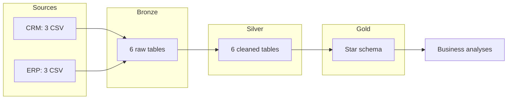
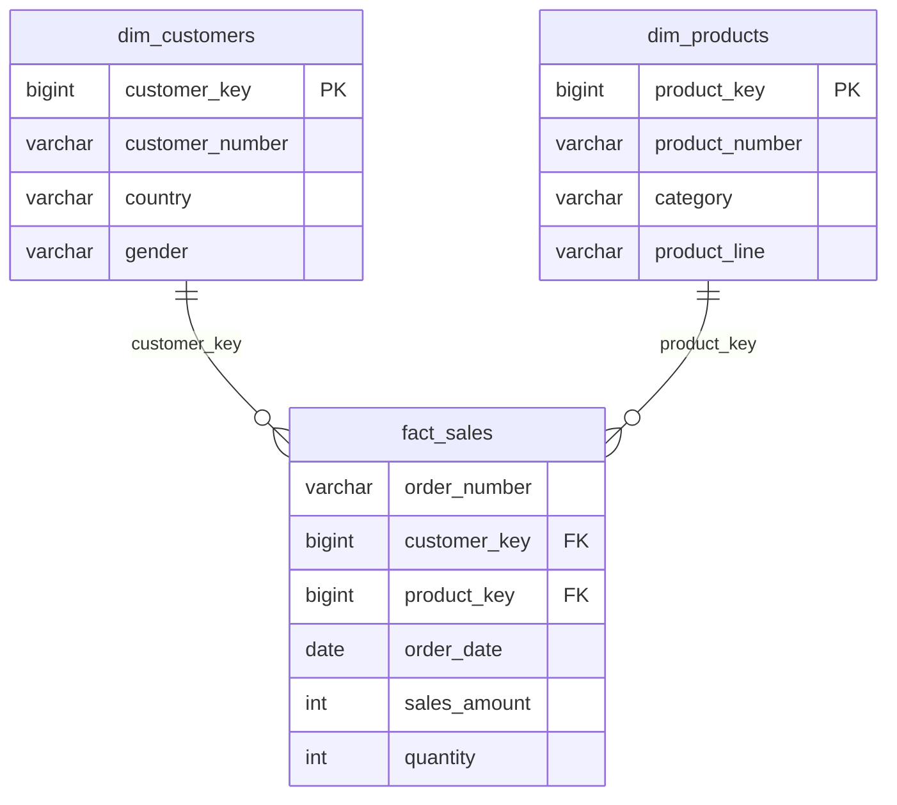

# VeloData Warehouse


End-to-end data warehouse on **PostgreSQL** using the **Medallion architecture** (Bronze → Silver → Gold).
It integrates sales data from two source systems (CRM and ERP), audits and fixes 12 types of data quality issues,
models the result as a **star schema**, and validates everything with **automated SQL tests run in CI** on every push.

> One command rebuilds the whole warehouse from raw CSV files and runs all tests: `make all`

---

## Architecture



| Layer | Role | Implementation |
| --- | --- | --- |
| **Bronze** | Raw copy of the sources, no transformation | `COPY` into 6 tables, full load, logged in `ops.etl_log` |
| **Silver** | Cleaned, typed, deduplicated, standardized data | PL/pgSQL procedure `silver.load_silver()` |
| **Gold** | Business-ready star schema | 3 views: `dim_customers`, `dim_products`, `fact_sales` |

## Tech stack

PostgreSQL 16 · PL/pgSQL · Docker Compose · Make · GitHub Actions · Git

## Quick start

Requirements: Docker and Make.

```bash
git clone https://github.com/Emmka1412/velodata-warehouse.git
cd velodata-warehouse
cp .env.example .env
make all
```

`make all` starts PostgreSQL, loads Bronze, Silver and Gold, then runs the 11 quality tests.

## Data quality

The raw data was audited before any transformation ([audit queries](sql/audit/bronze_profiling.sql)).
Every issue was measured, then handled with a documented decision ([full quality report](docs/data_quality_report.md)).

| Issue | Volume | Decision |
| --- | --- | --- |
| Duplicate customers | 5 ids | Keep the most recent record (`ROW_NUMBER`) |
| Customers without id | 4 rows | Excluded |
| Product end date before start date | 200 rows | Recomputed with `LEAD()`: next version start − 1 day (SCD type 2) |
| Invalid order dates | 19 rows | Set to NULL, sale kept (revenue preserved) |
| Inconsistent sales amounts | 35 rows | Recomputed: amount = quantity × \|price\| |
| Country written 12 ways (US, USA, DE…) | 12 variants | Normalized to 7 values |

**Key integration fix:** CRM and ERP use different customer key formats (`AW00011000` vs `NASAW00011000` vs `AW-00011000`).
Before harmonizing the keys, only **40 %** of customers matched their ERP demographics and **0 %** matched their country.
After: **100 %**.

## Data model (Gold)



Column-level documentation: [data catalog](docs/data_catalog_gold.md).

## Testing and CI

11 SQL tests in [`tests/`](tests/) check uniqueness, allowed values, referential integrity and row counts.
A test is a query that returns the **anomalous rows**: it passes if it returns 0 rows.

GitHub Actions runs `make all` on a fresh machine for every push: the exact same command as locally.
To prove the tests actually catch errors, a deliberate bug was pushed on a test branch (removing a `TRIM`):
the CI failed on the right test.


## Business insights

Analyses in [`analyses/`](analyses/) answer business questions using only the Gold layer.

- **Revenue:** 29.4 M over Dec 2010 – Jan 2014, 27,659 orders, average basket of 1,061.
- **Products:** bikes generate **96.5 %** of revenue; accessories and clothing are marginal.
- **Countries:** the United States and Australia generate **62 %** of revenue. But Australia has the highest average basket (1,349), while the US ranks only 5th (993): the biggest market is not the one that spends most per order.
- **Customers:** **9 % of customers (VIP) generate 38 % of revenue**. 69 % are new customers spending 15× less on average: converting them is the main growth lever.
- **A trap avoided:** yearly revenue seems to collapse in 2014, but the data stops on 28 Jan 2014. 2010 and 2014 are partial periods and must not be compared with full years.

## What I would improve

- Join each sale to the product version valid at its order date (full SCD 2), instead of current versions only.
- Incremental loading instead of full reload, for larger volumes.
- Materialized views for the Gold layer, refreshed at the end of the pipeline.
- A dashboard (e.g. Metabase) on top of the Gold layer.

## Repository structure

```text
├── datasets/          raw CRM and ERP CSV files
├── sql/
│   ├── 00_init.sql    schemas and ETL log
│   ├── bronze/        raw tables + load procedure
│   ├── silver/        cleaned tables + transformation procedure
│   ├── gold/          star schema views
│   └── audit/         data quality audit and layer checks
├── tests/             automated SQL tests
├── analyses/          business questions
├── docs/              architecture, sources, quality report, data catalog
├── scripts/           test runner
├── Makefile           pipeline orchestration
└── .github/workflows/ CI
```

## Acknowledgements

The source datasets come from the **SQL Data Warehouse** project by
[Data With Baraa](https://github.com/DataWithBaraa/sql-data-warehouse-project) (MIT License),
also inspired by [Shiva-6816/sql-data-warehouse-project](https://github.com/Shiva-6816/sql-data-warehouse-project) (SQL Server).
This version was rebuilt on PostgreSQL and Docker, with an ETL log, a documented quality audit, automated tests and CI.
