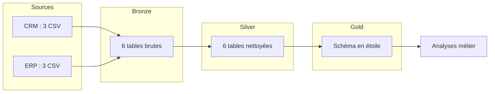

# Architecture

- **Bronze** : données brutes, chargées telles quelles depuis les CSV.
- **Silver** : données nettoyées, typées, dédoublonnées et standardisées.
- **Gold** : modèle en étoile (dim_customers, dim_products, fact_sales) prêt pour l'analyse.
